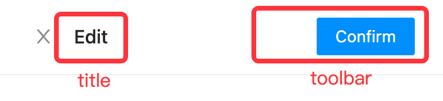

## drawer-form

drawer-form 代表一个带抽屉（drawer）容器的表单。

### 基本示例

<code src="../../../samples/template/drawer-form/Basic.tsx"></code>

## API

| 参数  | 说明                                                           | 类型   | 默认值 |
| ----- | -------------------------------------------------------------- | ------ | ------ |
| form  | Config除 [form](form/#api) 外，还有额外的 header 需要Config        | object | -      |
| props | 请参考 [antd Drawer](https://ant.design/components/drawer-cn/) | object | {}     |

#### form.header

对应抽屉容器的 header，示例如下：



| 参数    | 说明                      | 类型   | 默认值 |
| ------- | ------------------------- | ------ | ------ |
| title   | 弹框的 title，schema Config | object | -      |
| toolbar | 弹框的工具栏，schema Config | object | -      |

## Schema [action]

drawer-form 支持以下 schema，用于控制相应的交互和逻辑等。

### drawer-show

展示抽屉弹窗，示例如下：

```json
{
  "action": {
    "type": "drawer-show",
    "form": {
      "mode": "view"
    }
  }
}
```

| 参数 | 说明 | 类型 | 默认值 |
| --- | --- | --- | --- |
| form | Config参考 [form](form/#api) | object | - |
| schema | 有多个不同的 form 弹窗时指定对应的 form schema，示例参考 [search-table](search-table#多个弹窗表单) | string | 'form' |

### drawer-hide

隐藏抽屉

### drawer-validate-form

验证表单的值，合法则返回格式化后的表单值，存在 ctx 的 `chain` 中。

### drawer-disable-toolbar-primary-button

为 toolbar 中 type 为 `primary` 的 button 添加 `disabled` 属性，可以有效解决多次提交的问题。

### drawer-enable-toolbar-primary-button

删除 toolbar 中 type 为 `primary` 的 button 的 `disabled` 属性，因为正常情况下，提交后会销毁 drawer-form，所以大多数情况下无需使用。
